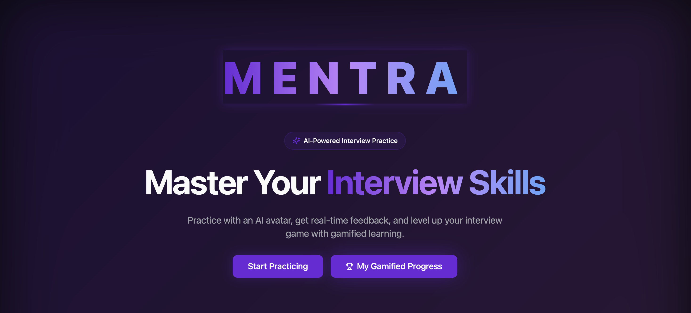
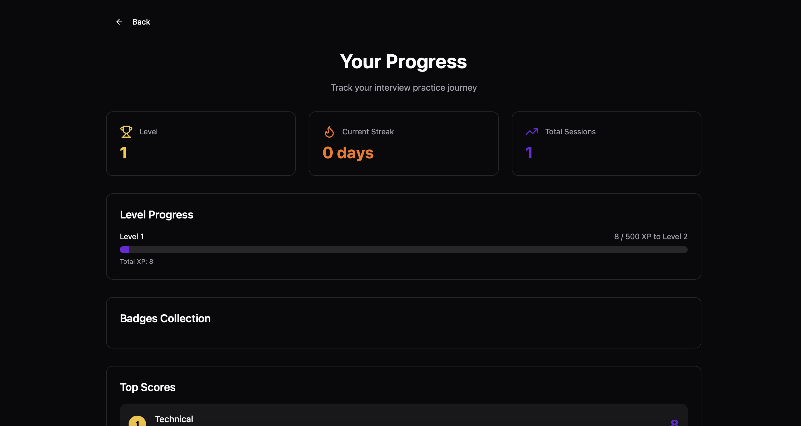
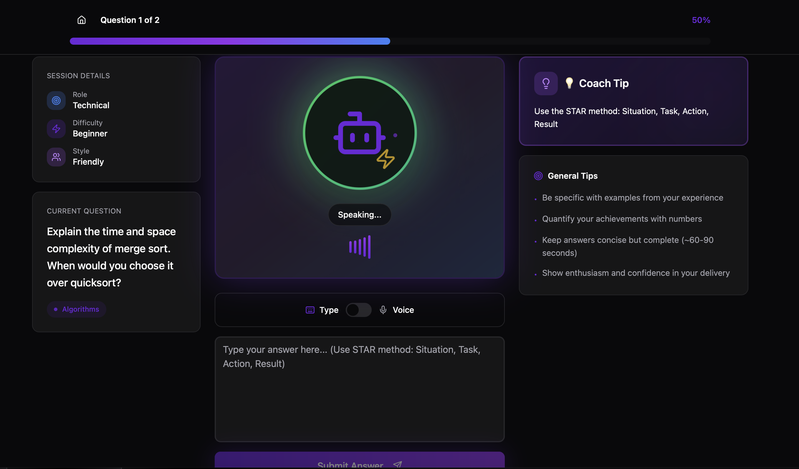
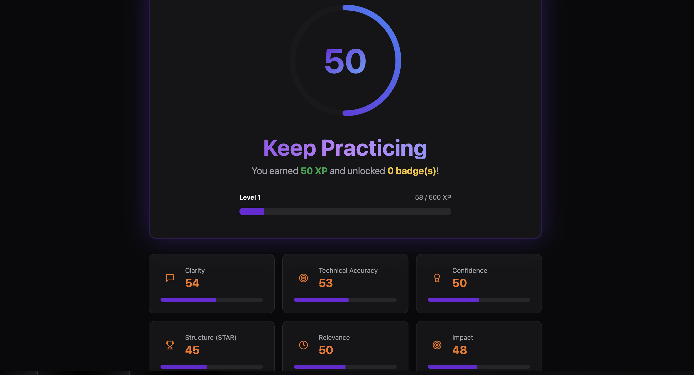
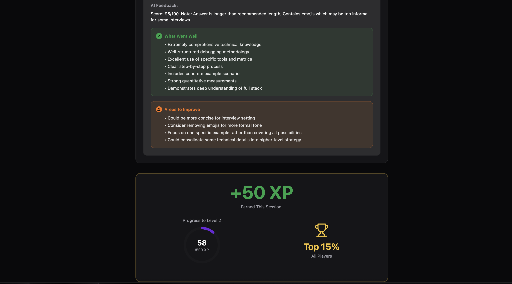

# **Mentra: AI-Powered Interview Practice Platform**

> 🎓 **Honourable Mention** at the **Back-to-Uni Hackathon 2025**

**Live Demo:** [https://mentrahackathon.lovable.app/](https://mentrahackathon.lovable.app/)

---

## 🚀 Overview

**Mentra** is an innovative, **AI-powered interview preparation platform** designed to close the **53% interview confidence gap** among students and graduates.  
The platform provides **realistic, role-specific AI interview simulations** with **voice or text-based input**, **instant feedback**, and **gamified progression** — all under a **privacy-first, GDPR-compliant architecture**.

---

## 💡 Core Features

### 🗣️ AI Interview Practice

- Practice interviews across six professional domains: **Technical, Data Science, Product, Marketing, Sales, and HR**.  
- Choose **voice** or **text** input for accessibility and preference.  
- Receive **real-time AI feedback** on clarity, confidence, and structure.

### 🤖 AI Feedback Engine

- Dynamic evaluation powered by **OpenRouter (GPT/Gemini)**.  
- Scores answers on multiple criteria (delivery, structure, confidence).  
- Feedback generated in seconds — no user data retained or stored.

<!-- ### 🧑‍🎓 Avatar Personalities

- Four AI interviewer archetypes with varying tones and difficulty levels:
  - **Alex (Challenger)** – Demanding and assertive  
  - **Sam (Supporter)** – Friendly and encouraging  
  - **Jordan (Neutral)** – Balanced and professional  
  - **Casey (Conversational)** – Relaxed and casual  
- Personality affects question tone, follow-ups, and feedback style. -->

### 🎮 Gamification System

- Earn **XP, badges, and streaks** through consistent practice.  
- Level up with visual celebrations and confetti animations.  
- Review past performance via local progress tracking.

### 🔒 Privacy by Design

- **Audio never leaves the browser.**  
- No storage of recordings, transcripts, or personal identifiers.  
- Only anonymous statistics (XP, badges, scores) stored in `localStorage`.  
- Fully compliant with **GDPR Article 25 (Privacy by Design)**.

---

## 🏗️ Tech Stack

| Layer | Technologies |
|:------|:--------------|
| **Frontend** | React 18, TypeScript, Vite |
| **Styling** | Tailwind CSS, shadcn/ui, Framer Motion |
| **State Management** | Zustand (persistent store) |
| **Backend / API** | Lovable Cloud (Supabase Edge Functions) |
| **AI Integration** | OpenRouter API (GPT/Gemini) |
| **Speech Processing** | Web Speech API (Speech-to-Text & Text-to-Speech) |
| **Utilities** | zod, date-fns, recharts, lucide-react |

---

## 🧠 Why Mentra Stands Out

✅ **Multimodal input** — voice or text-based practice  
✅ **Privacy-first by architecture** — no audio storage  
✅ **Gamified experience** with badges, XP, and streaks  
✅ **Role-specific interview scenarios** for realistic practice  
✅ **Ethical AI evaluation** — unbiased, inclusive, accent-agnostic  
✅ **Zero cost barrier** — professional-grade training accessible to all  

---

## 🏅 Badge & Progression System

| **Badge** | **Criteria** |
|------------|--------------|
| Getting Started | Complete your first session |
| STAR Pro | Apply STAR method in at least two answers |
| Concise Communicator | Keep responses under 90 seconds |
| Resilient | Complete 10+ questions in one session |
| Data-Driven | Reference metrics or data in responses |
| 3-Day Streak | Practice for three consecutive days |
| Week Warrior | Practice for seven consecutive days |
| Perfectionist | Score 95+ in one session |

---

## 🌐 User Journey

1. **Landing Page** – Overview and “Start Practicing” CTA  
2. **Role Selection** – Choose from six professional tracks  
3. **Avatar Selection** – Pick interviewer personality and tone  
4. **Session Setup** – Configure difficulty, style, and duration  
5. **Interview Simulation** – Respond via voice or text  
6. **Feedback Summary** – View AI evaluation and gain XP  

---

## 🔮 Future Enhancements

- 📅 **Mock Interview Scheduling** (calendar integration)  
- 🧑‍🤝‍🧑 **Peer Practice Mode** for collaborative learning  
- 🧩 **Company-Specific Question Packs** (e.g., Google, Amazon)  
- 📊 **Advanced Analytics Dashboard** for progress tracking  
- 📱 **Mobile App** for cross-platform access  

---

## 🧩 Visual Overview

### 🏠 Landing Page

*The starting point for users — introducing Mentra’s value and guiding them to start practicing.*

### 📈 Tracking Progress

*Interface showing user progression, XP accumulation, streaks, and overall session history.*

### 🎤 Interview Simulation

*Interactive AI interview interface supporting both voice and text responses for realistic practice.*

### 📊 Scoring

*AI-generated performance summary including clarity, confidence, structure scoring, and detailed feedback per question.*

### 🏅 Badges & Feedback

*Gamified learning interface displaying earned badges, XP, and streaks to encourage consistent practice.*
